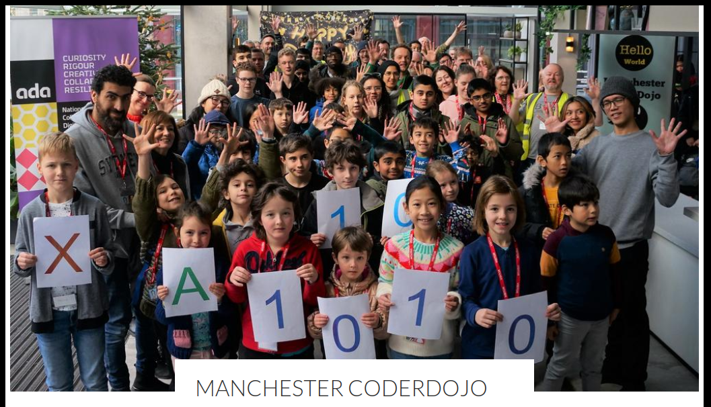
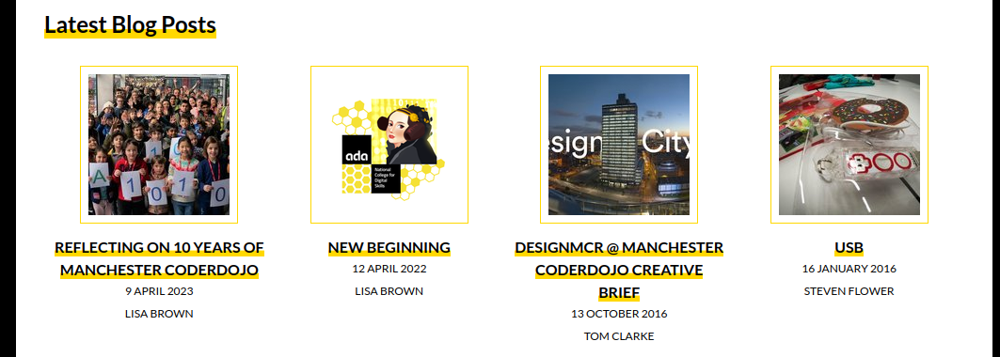

# Website user guide

Changes to the website can be performed directly on GitHub, or locally by pushing with git.

It is recommended that editors push to the `draft` branch and create a Pull Request for each change,
so they can review the changes on the draft website at `draft.mcrcoderdojo.org.uk`.

Content is in [content](content/), organised by [pages](content/pages/) and [posts](content/posts/).
Posts are further organised by type (purely for neatness) as explained

A post or page has a metadata file containing things like title, cover image and published date.

Post and page content can be written in markdown (`index.md`) or HTML (`index.html`). Markdown is
easier for simple text with formatting, and HTML tags can be included in a markdown file, but HTML
is available if you need more control.

Templates are in [templates](templates/). Each type of webpage has a corresponding template, for
example the homepage uses [home.pt](templates/home.pt); and general pages use
[page.pt](templates/page.pt).

## Pages

- Pages are in [content/pages](content/pages/)

- The folder name denotes the page URL e.g. `/about/` (with the exception of the homepage)

- Page metadata is in `meta.yml`

- Page content is in `index.html` or `index.md`

- Images are in `images` (see the images section below)

### Edit a page

Edit metadata in `meta.yml` and/or page content in `index.md` or `index.html`

### Add a new page

Create a new folder in [content/pages](content/pages/), add a `meta.yml` and add the required
metadata (see another page for an example), and add an `index.md` or `index.html` and add page
contents to it.

## Posts

- Posts are in [content/posts](content/posts/)

- Posts are further organised into [blog](content/posts/blog/), [events](content/posts/events/) and
  [newsletters](content/posts/newsletters/), (for neatness only, this does not effect the site
  structure)

- Events are further organised by year, again purely for neatness

- The folder name denotes the URL slug e.g.

- Page metadata is in `meta.yml`

- Tags are not used except to categorise events

- Page content is in `index.md` or `index.html`

- Images are in `images` (see the images section below)

### Edit a blog post or event

Edit metadata in `meta.yml` and/or post content in `index.md` or `index.html`

### Add a new blog post

Create a new folder in [content/posts/blog](content/posts/blog/), add a `meta.yml` and add the
required metadata (see another page for an example), and add an `index.md` or `index.html` and add
page contents to it.

### Add a new event

Events are just posts tagged with `events`, but for organisation's sake, they are stored in
[content/posts/events](content/posts/events). When creating a new event, make sure the `meta.yml`
file includes the `events` tag:

```yml
tags:
- events
```

### Newsletters

We have preserved old newsletters (which are just posts) in the
[content/posts/newsletters](content/posts/newsletters/) folder. There is no intention for this to be
revived or reused, and there is no list of them except that they remain in the blog index.

## Images

Images can be added to pages and posts by adding them to the relevant `images` folder and including
an image tag in the markdown or HTML content, referring to the image's relative location e.g.
`images/coderdodjo.png`.

Markdown:

```markdown

```

HTML:

```html

```

**Images must be no wider than 1024px. Please reduce the size before pushing or uploading**.

### Cover images

Pages and posts have cover images which appear at the top of the page above the title:



Cover images are set in the `meta.yml` file:

```yml
cover_image: coderdojo.png
```

**Cover images must be no wider than 1024px. Please reduce the size before pushing or uploading**.

### Thumbnails

Posts have thumbnail images which appear in a grid with other posts:



Thumbnail images are set in the `meta.yml` file:

```yml
thumbnail: coderdojo_thumb.png
```

**Thumbnail images must be square and should ideally be exactly 150px x 150px, but must be no bigger
than 1024px x 1024px. Please reduce the size before pushing or uploading**.

## Advanced

Advanced usage probably requires running locally, but small changes can be made directly on GitHub,
and tested on the draft branch.

### Edit the CSS

The stylesheet is in [static/style.css](static/style.css). Be careful!

### Edit a template

Templates are in [templates](templates/). Be careful!

Note: you can make a new template and designate it as the custom template for a regular page by
adding to the page's `meta.yml`:

```yml
template: contact.pt
```

Special pages like the homepage, blog index and the events page have their own templates anyway.

### Do something more advanced

See the [Beemo docs](https://beemo.readthedocs.io/en/stable/) and [Chameleon
docs](https://chameleon.readthedocs.io/en/latest/) or ask your favourite agentic AI tool
:smile: (or ask Ben)